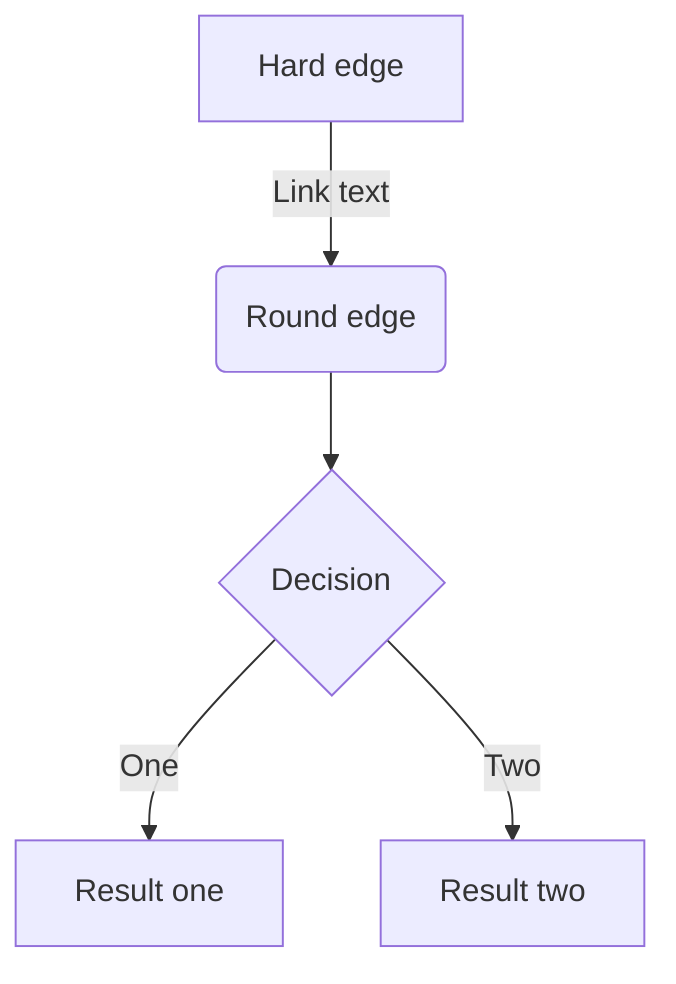

为支持画图，写公式等 ，可在Visual studio code 安装Markdown Preview Mermaid Support 和 Markdown Preview Enhanced插件


<!-- TOC -->

- [分级标题](#分级标题)
- [段内强制换行](#段内强制换行)
- [斜体与粗体](#斜体与粗体)
- [分割线](#分割线)
- [转义字符](#转义字符)
- [加入代码段](#加入代码段)
- [引用](#引用)
    - [引用的多层嵌套](#引用的多层嵌套)
- [列表](#列表)
    - [无序列表](#无序列表)
    - [有序列表](#有序列表)
- [超链接](#超链接)
- [锚点](#锚点)
- [插入图像](#插入图像)
- [注脚](#注脚)
- [表格](#表格)
    - [利用excel转变md表格](#利用excel转变md表格)
- [书写公式](#书写公式)
- [自动生成目录](#自动生成目录)
- [流程图](#流程图)

<!-- /TOC -->

## 分级标题
第一种写法
```java
# h1           一级标题 文章大标题
## h2          二级标题  
### h3         三级标题 段落标题
#### h4
##### h5
###### h6
####### h7      // 错误代码
######## h8     // 错误代码
######### h9    // 错误代码
########## h10  // 错误代码
注意中间空一格
```
演示效果：


第二种写法
```java
高阶标题（同一级标题）
======================
次阶标题（同二级标题）
---------------------

或者这么写：
高阶标题（同一级标题）
=

次阶标题（同二级标题）  
-

注意符号和标题不要隔行
```
效果：


## 段内强制换行
段落的前后要有空行，所谓的空行是指没有文字内容。若想在段内强制换行的方式是**使用两个或以上空格加上回车**（引用中换行省略回车）。

## 斜体与粗体
     *斜体*或_斜体_
     **粗体**
     ***加粗斜体***
     ~~删除线~~
 演示效果：

 

## 分割线

你可以在一行中用三个以上的星号、减号、底线来建立一个分隔线。

         ---
         ***
         ___
效果：

---
***
___

##  转义字符
‘\’ Markdown支持的转义字符列表：

    \   反斜线
    `   反引号
    *   星号
    _   底线
    {}  花括号
    []  方括号
    ()  括弧
    #   井字号
    +   加号
    -   减号
    .   英文句点
    !   惊叹号
  
## 加入代码段

**行内短代码可用` `` `**，添加代码段可以在每一行的缩进是4个空格或者1个tab制表符或者使用

    ```
    内容
    ```
添加HTML代码（在代码区块里面， & 、 < 和 > 会自动转成 HTML 实体，这样的方式让你非常容易使用 Markdown 插入范例用的 HTML 原始码，只需要复制贴上，剩下的 Markdown 都会帮你处理）

     例1：   <div class="footer">
        © 2004 Foo Corporation
        </div>
 显示效果：
<div class="footer">
   © 2004 Foo Corporation
</div>

      例2：  <table>
            <tr>
                <th rowspan="2">值班人员</th>
                <th>星期一</th>
                <th>星期二</th>
                <th>星期三</th>
            </tr>
            <tr>
                <td>李强</td>
                <td>张明</td>
                <td>王平</td>
            </tr>
        </table>
显示效果：
<table>
    <tr>
        <th rowspan="2">值班人员</th>
        <th>星期一</th>
        <th>星期二</th>
        <th>星期三</th>
    </tr>
    <tr>
        <td>李强</td>
        <td>张明</td>
        <td>王平</td>
    </tr>
</table>
    
     ```java
     代码
     ```

     ```php
     代码
     ```

     ```javascript
     代码
     ```
     等等
   
## 引用
引用需要在被引用的文本前加上>符号，Markdown 也允许你偷懒只在整个段落的第一行最前面加上 >

    > 这是一个有两段文字的引用,  
      无意义的占行文字1.
      无意义的占行文字2.
    
    > 无意义的占行文字3.
      无意义的占行文字4.
> 这是一个有两段文字的引用,  
> 无意义的占行文字1.
> 无意义的占行文字2.

>无意义的占行文字3.
>无意义的占行文字4.
### 引用的多层嵌套
区块引用可以嵌套（例如：引用内的引用），只要根据层次加上不同数量的 > 

    > 请问 Markdwon 怎么用？ - 小白
    >> 自己看教程！ - 愤青
    >>> 教程在哪？ - 小白

效果：
> 请问 Markdwon 怎么用？ - 小白
> > 自己看教程！ - 愤青
> > > 教程在哪？ - 小白 

+ 如果>、>>和>>>等嵌套使用的话，从>>>退到>时，必须之间要加上一个空行作为过渡，否则默认为下一行和上一行是同一级别的引用
+ 引用完之后，必须再空一行，重新一个新的开始，否则，以后的文字都将在引用的范围内
+ 引用的区块内也可以使用其他的 Markdown 语法，包括标题、列表、代码区块等


## 列表
### 无序列表
使用 *，+，- 表示无序列表。

    - 2. 列表2
    - 3. 列表3
    - 1. 列表1
效果：
- 2. 列表2
- 3. 列表3
- 1. 列表1 
###  有序列表
使用数字接着一个英文句点

    2. 列表2
    3. 列表3
    1. 列表1
效果：

  2. 列表2
  3. 列表3
  4. 列表1
## 超链接
 有两种链接方式  
​    
    `行内式链接 = [内容](地址 "标题") ` 标题是可选的，可以用单引号或双引号
    [妙语连珠](http://www.baidu.com)是什么意思
    
    参考式链接 = [内容][参考标识符]
    参考标识符 = [标识符]: 地址 "标题"
    例：
    [妙语连珠]: http://www.baidu.com
    [妙语连珠]是什么意思
演示效果：

行内式 

[妙语连珠](http://www.baidu.com)是什么意思

参数式

[妙语连珠]: http://www.baidu.com

[妙语连珠]是什么意思

    还有一个自动链接
    <http://baidu.com>
 效果：

<http://baidu.com>


## 锚点
也就是页内超链接，链接本文档内的某些元素，实现在页内跳转，仅支持在标题后插入锚点  

    [流程图](#流程图)

效果：

跳转到[流程图](#流程图)


## 插入图像
     行内式
     语法说明：
     
     或  


     参考式
     在文档要插入图片的地方写![图片Alt][标记]
     在文档的最后写上[标记]:图片地址 “Title”
     例：
    ![美丽花儿][flower]   或  ![][flower]   注意下方至少空一行
    
     [flower]:C:/Users/Administrator/Desktop/Md格式总结/118图片.png

![][flower] 

[flower]:C:/Users/Administrator/Desktop/Md格式总结/118图片.png

## 注脚
在需要添加注脚的文字后加上脚注名字[^注脚名字],称为加注。 然后在文本的任意位置(一般在最后)添加脚注，脚注前必须有对应的脚注名字。

注意：经测试注脚与注脚之间必须空一行，不然会失效。成功后会发现，即使你没有把注脚写在文末，经Markdown转换后，也会自动归类到文章的最后

使用 Markdown[^1]可以效率的书写文档, 直接转换成 HTML[^2], 你可以使用 Leanote[^Le]编辑器进行书写。

[^1]: Markdown是一种纯文本标记语言

[^2]: HyperText Markup Language 超文本标记语言

[^Le]: 开源笔记平台，支持Markdown和笔记直接发为博文

## 表格
用|表示表格纵向边界，表头和表内容用-隔开，并可用:进行对齐设置，两边都有:则表示居中，若不加:则默认左对齐。

详细说明：

    ----:为右对齐
    :----为左对齐
    :---:为居中对齐
    -----为默认左对齐
注意：-这样的分隔符至少要有1个！目前测试是这样的！

    例1：
    dog | bird | cat 
    ----|------|----
    foo | foo  | foo
    bar | bar  | bar
    baz | baz  | baz

    例2：
    Tables        | Are           | Cool  
     ------------- |:-------------:| -----:
    col 3 is      | right-aligned |\$1600 
    col 2 is      | centered      |\$12 
    zebra stripes | are neat      |$1 

dog | bird | cat
----|------|----
foo | foo  | foo
bar | bar  | bar
baz | baz  | baz

 Tables        | Are           | Cool  
 ------------- |:-------------:| -----:
 col 3 is      | right-aligned |\$1600 
 col 2 is      | centered      |\$12 
 zebra stripes | are neat      |$1 

### 利用excel转变md表格
像错误码类xml文件,可直接改为excel文件，将内容复制粘贴到Typora上可直接生成表格

## 书写公式


$ 表示行内公式：

质能守恒方程可以用一个很简洁的方程式` $E=mc^2$` 来表达。  $E=mc^2$

 $$ 表示整行公式：

    $$f(x_1,x_x,\ldots,x_n) = x_1^2 + x_2^2 + \cdots + x_n^2 $$

    $$\sum^{j-1}_{k=0}{\widehat{\gamma}_{kj} z_k}$$

    $$\sum_{i=1}^n a_i=0$$
效果：

$$f(x_1,x_x,\ldots,x_n) = x_1^2 + x_2^2 + \cdots + x_n^2 $$

$$\sum^{j-1}_{k=0}{\widehat{\gamma}_{kj} z_k}$$

$$\sum_{i=1}^n a_i=0$$


## 自动生成目录
在文档开头加入`[toc]` 或者使用Markdown TOC 插件，可自动生成目录，后者可实现文内锚点


## 流程图
具体语法参见

https://mermaidjs.github.io/sequenceDiagram.html

        ```mermaid
        graph TD
        A[Hard edge] -->|Link text| B(Round edge)
        B --> C{Decision}
        C -->|One| D[Result one]
        C -->|Two| E[Result two]
        ```
        ```mermaid
        gantt
        dateFormat  YYYY-MM-DD
        title Adding GANTT diagram to mermaid

        section A section
        Completed task            :done,    des1, 2014-01-06,2014-01-08
        Active task               :active,  des2, 2014-01-09, 3d
        Future task               :         des3, after des2, 5d
        Future task2               :         des4, after des3, 5d

```mermaid
gantt
dateFormat  YYYY-MM-DD
title Adding GANTT diagram to mermaid

section A section
Completed task            :done,    des1, 2014-01-06,2014-01-08
Active task               :active,  des2, 2014-01-09, 3d
Future task               :         des3, after des2, 5d
Future task2               :         des4, after des3, 5d


